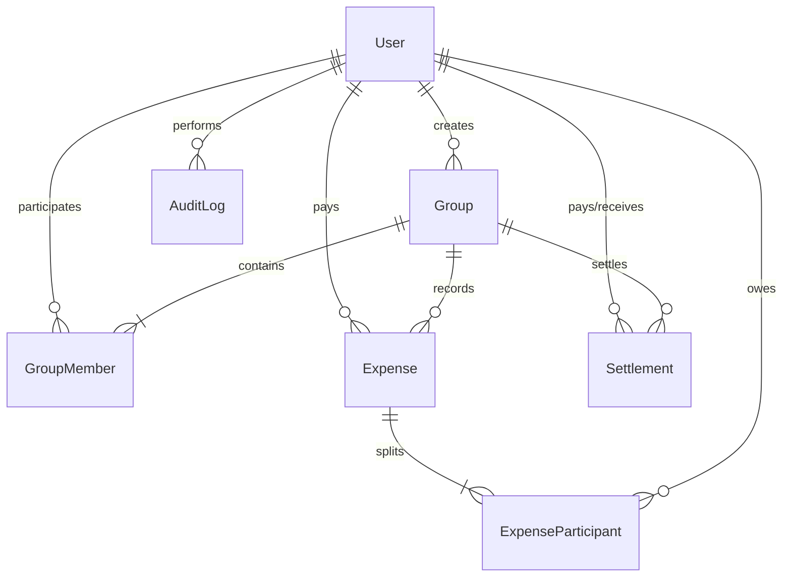

# SplitLedge Scope and System Design

## 1. Database Schema Specifications

Our MongoDB / Mongoose schemas represent entities and relationships as follows:

### User
```typescript
{
  _id: ObjectId,
  name: String,
  email: String (unique),
  password: String (hashed),
  avatar: String,
  createdAt: Date,
  updatedAt: Date
}
```

### Group
```typescript
{
  _id: ObjectId,
  name: String,
  description: String,
  createdBy: ObjectId -> User,
  members: [
    {
      user: ObjectId -> User,
      joinedAt: Date,
      leftAt: Date (optional),
      status: String ['ACTIVE', 'LEFT']
    }
  ],
  createdAt: Date,
  updatedAt: Date
}
```

### Expense
```typescript
{
  _id: ObjectId,
  group: ObjectId -> Group,
  title: String,
  description: String,
  amount: Number,
  currency: String ['INR', 'USD'],
  exchangeRate: Number,
  amountInINR: Number,
  paidBy: ObjectId -> User,
  expenseDate: Date,
  splitType: String ['equal', 'exact', 'percentage', 'shares'],
  participants: [
    {
      user: ObjectId -> User,
      shareAmount: Number,
      percentage: Number (optional),
      shares: Number (optional)
    }
  ],
  createdAt: Date,
  updatedAt: Date
}
```

### Settlement
```typescript
{
  _id: ObjectId,
  group: ObjectId -> Group,
  payer: ObjectId -> User,
  receiver: ObjectId -> User,
  amount: Number,
  date: Date,
  note: String,
  createdAt: Date
}
```

### ImportLog
```typescript
{
  _id: ObjectId,
  rowNumber: Number,
  issueType: String,
  description: String,
  actionTaken: String,
  status: String ['WARNING', 'ERROR', 'SUCCESS'],
  createdAt: Date
}
```

### AuditLog
```typescript
{
  _id: ObjectId,
  entityType: String,
  entityId: String,
  action: String,
  oldValue: Mixed,
  newValue: Mixed,
  performedBy: ObjectId -> User,
  createdAt: Date
}
```

---

## 2. CSV Anomalies Found in `Expenses Export.csv`

The following anomalies are represented in the raw data files:

1. **Duplicate Transaction Entries** (e.g. Rows 5 and 6: Dinner at Marina Bites vs dinner - marina bites).
2. **Duplicate Entries with Different Amounts** (e.g. Rows 24 and 25: Dinner at Thalassa (2400) vs Thalassa dinner (2450) with different payers).
3. **Negative Payout Amounts / Refunds** (e.g. Row 26: Parasailing refund -30 USD).
4. **Invalid Date Formats** (e.g. Row 27: date format is `Mar-14`, Row 34: Rohan asks if `04-05-2026` is May 4 or April 5).
5. **Invalid Amount Formats** (e.g. Row 7: Amount written as `"1,200"` containing double quotes and comma separation).
6. **Missing / Empty Currency** (e.g. Row 28: Groceries DMart has empty currency column).
7. **Unknown Users** (e.g. Row 11: Paid by `Priya S` (typo), Row 23: Dev's friend `Kabir` joined for the day).
8. **Settlement Logged as Expense** (e.g. Row 14: `Rohan paid Aisha back` with no split type, Row 38: `Sam deposit share` deposit payment directly to Aisha).
9. **Timeline Outliers: Expense After Member Left** (e.g. Row 36: Meera left group Sunday Mar 29, but was split with in April 2 BigBasket groceries).
10. **Timeline Outliers: Expense Before Member Joined** (e.g. Row 39: Sam moves in April 8, but we verify that he is not split into expenses prior to that).
11. **Missing Payer** (e.g. Row 13: House cleaning supplies payer column is empty).
12. **Unsupported Split Details** (e.g. Row 15: percentages sum to 110%).
13. **Unequal Split naming** (e.g. Row 12: split type written as `unequal` which maps to `exact` split type).

---

## 3. CSV Import Policies

| Anomaly Type | Verification Action | System Handling Policy |
| :--- | :--- | :--- |
| **Duplicate Expense** | Matches title, date, payer, and amount. | Flag and request manual approval. |
| **Duplicate different amount** | Matches title, date, payer, but different amounts. | Flag conflict, hold row for manual choice. |
| **Negative Amount** | Amount < 0 | Treat as refund (deduct share from participant owed totals). |
| **Invalid Date** | Unparseable date strings | Skip row, log ERROR. |
| **Unknown User** | Name does not match database user | Hold row, require user to map name to a member. |
| **Settlement as Expense** | Description indicates settlement and split_type is empty | Auto-convert row into a Settlement payment. |
| **Expense After Member Left** | Expense Date > member.leftAt | Exclude member from split calculation and import. |
| **Expense Before Member Joined**| Expense Date < member.joinedAt | Exclude member from split calculation and import. |
| **Invalid Percentage** | Sum of percentages != 100% | Reject row, log ERROR. |
| **Missing Payer** | Payer column is blank | Hold row, require user to map to group member. |

---

## 4. Entity-Relationship (ER) Diagram


